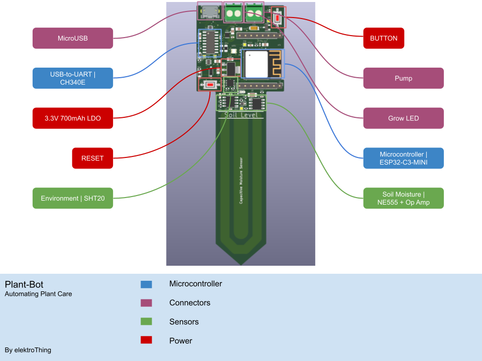

# Plant Bot - Automating Plant Care

 
The Plant Bot is an open-source ESP32-based project that allows for a single PCB to perform the function of sensing moisture levels, watering, provide illumination as well as control & communicate with the user over WiFi/BLE. 
 
 This repository contains the following content;
 - Schematic
 - Example Code for plant caring
 
 ## What is it

Plant Bot is a device that allows you to convert your favourite pot to play an active role in your plant caring duties. The PCB is designed to be powered over USB and contains all of the necessary functionality including the moisture sensor reducing the need for extra wires. The result is a compact package that can enable plants to be looked after remotely and for much longer. I personally found this useful with my office plants in today's world of working from home as well as when I am away from home for an extended period.

Leveraging on existing open-source projects the Plant Bot can be programmed using Micropython, and Arduino. Power users can also use the [ESP-IDF](https://github.com/espressif/esp-idf) tool for maximum customisation. 

Key Features;
- Corrosion resistant capacitive moisture sensor
- Easy mounting by simply embedded the moisture sensor stake into the pot if your choosing.
- Pump Driver
- String LED Control
- WiFi and Bluetooth Connectivity
- Environment Sensor (Temperature + Humidity)

**Available to buy on [Tindie](https://www.tindie.com/products/elektrothing/plant-bot/).**

## Use cases
The example code included in this repository demonstrate a use case and capability of the device.

### Fully Automated Plant Care

This program measures the soil moisture, environmental temperature and humiditiy (SHT20), and performs several actions based on the readings received. The moisture level is tied to the colour of the WS2812B LED where it cycles from red (driest) to blue (dampest). This gives provides the user with visual feedback as to what the soil moisture level is like. It also has a seperated LED that turns on the indicate that the pump is being driven to replenish the soil water levels. Finally as it is based of an ESP32, it has full WiFi and BLE connectivity which in this example I have used to send the readings to a Thingspeak channel. Here is a screenshot of the data collected.

## Specification
* Microcontroller | [ESP32-C3-MINI](https://www.espressif.com/sites/default/files/documentation/esp32-c3-mini-1_datasheet_en.pdf)
    * WiFi | 802.11b/g/n
    * Bluetooth | BLE 5.0
    * FLASH | 4MB
    * Programming | USB over UART (CP2102)
* Environment Sensor | [SHT20](https://sensirion.com/products/catalog/SHT20/)
    * Temperature Accuracy | to within 0.3 °C
    * Humidity Accuracy | to within 3%RH
    * Interface | I²C
* Motor Driver | [DRV8837CDSGR](https://www.ti.com/product/DRV8837C)
    * Peak Current | 1.2A
    * Voltage | 5V (VUSB) 
    * Interface | GPIO
* Power | 700mA 3.3V LDO
* Mounting | FR-4 Stake into Soil

## License

MIT License

Copyright (c) 2022 elektroThing

Permission is hereby granted, free of charge, to any person obtaining a copy
of this software and associated documentation files (the "Software"), to deal
in the Software without restriction, including without limitation the rights
to use, copy, modify, merge, publish, distribute, sublicense, and/or sell
copies of the Software, and to permit persons to whom the Software is
furnished to do so, subject to the following conditions:

The above copyright notice and this permission notice shall be included in all
copies or substantial portions of the Software.

THE SOFTWARE IS PROVIDED "AS IS", WITHOUT WARRANTY OF ANY KIND, EXPRESS OR
IMPLIED, INCLUDING BUT NOT LIMITED TO THE WARRANTIES OF MERCHANTABILITY,
FITNESS FOR A PARTICULAR PURPOSE AND NONINFRINGEMENT. IN NO EVENT SHALL THE
AUTHORS OR COPYRIGHT HOLDERS BE LIABLE FOR ANY CLAIM, DAMAGES OR OTHER
LIABILITY, WHETHER IN AN ACTION OF CONTRACT, TORT OR OTHERWISE, ARISING FROM,
OUT OF OR IN CONNECTION WITH THE SOFTWARE OR THE USE OR OTHER DEALINGS IN THE
SOFTWARE.
